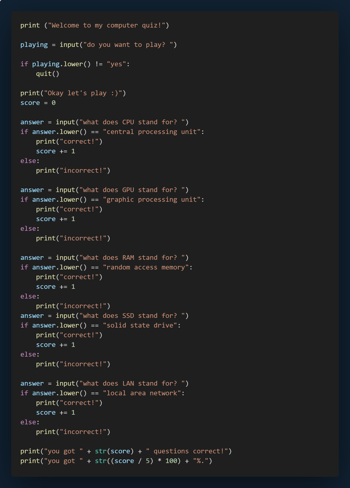

# Project 1 (QuizGame)

## Introduction

This Python script is a simple computer quiz game that tests the user's knowledge of common computer-related acronyms. The game begins by asking the user if they want to play. If the user agrees, they are prompted with a series of questions about what certain acronyms stand for. Each correct answer earns the user a point, and at the end of the quiz, the user's total score and percentage of correct answers are displayed.

