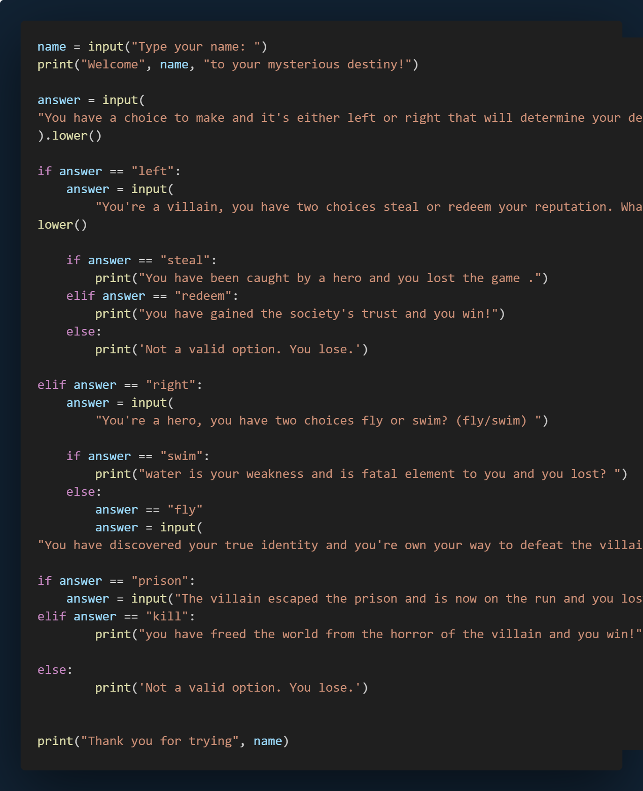

# Project 4

## Choose Your Own Destiny Game

## Introduction

This Python script is an interactive story game that leads the user through a series of choices, each determining the user's destiny. The user starts by entering their name and is then prompted to make decisions that affect the outcome of the story. Depending on the choices made, the user can either win or lose the game. The story branches based on whether the user chooses to be a villain or a hero and continues with further choices that ultimately determine their fate.

