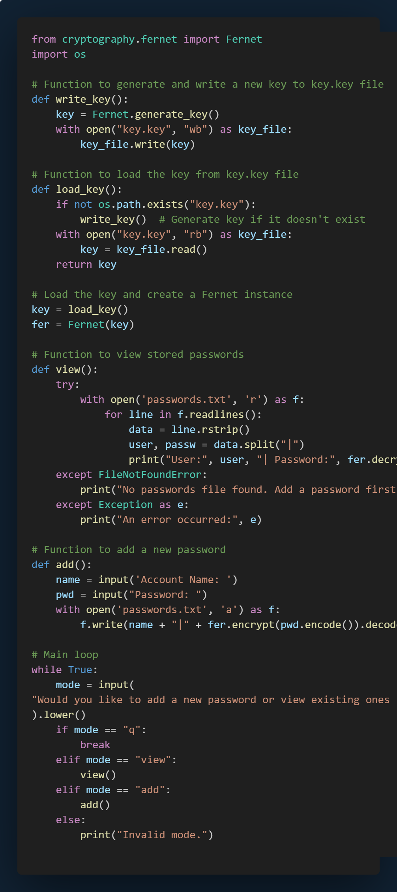

# Project 5

## Password Manager.

## Introduction

This Python script is a simple password manager that allows users to securely store and retrieve passwords for various accounts. It uses the cryptography library to encrypt and decrypt the passwords, ensuring that they are stored securely in a text file. Users can add new passwords or view existing ones through a command-line interface. The encryption key is stored in a separate file (key.key), and the passwords are saved in an encrypted format in passwords.txt.

